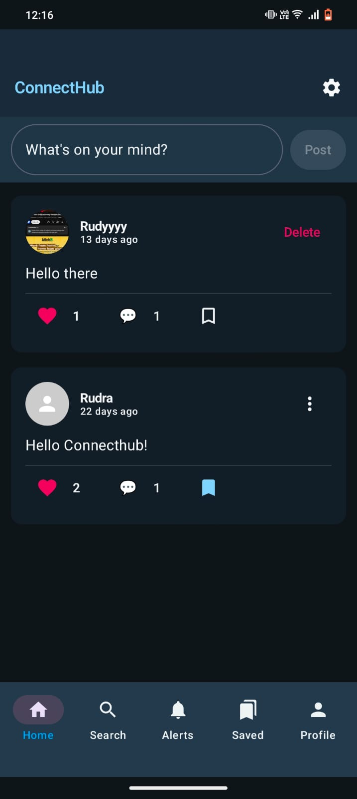
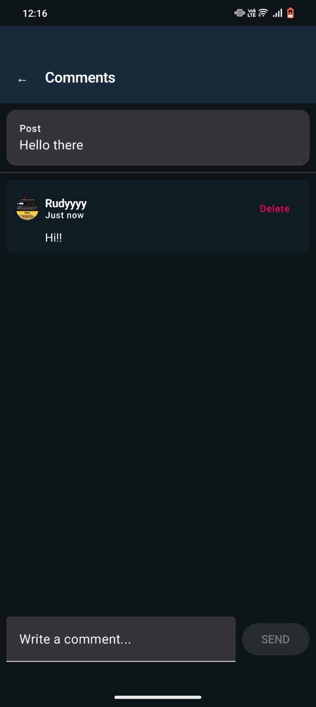
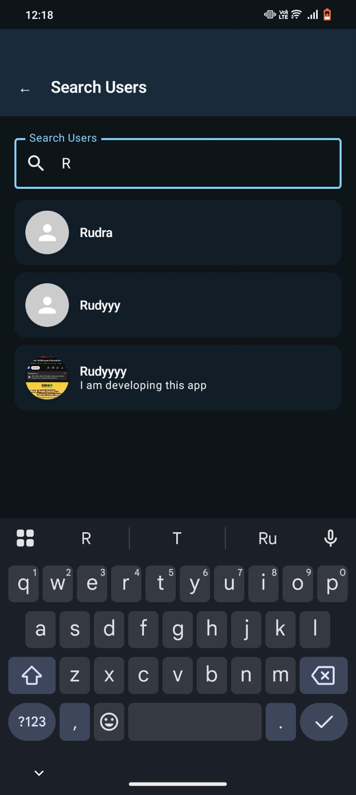
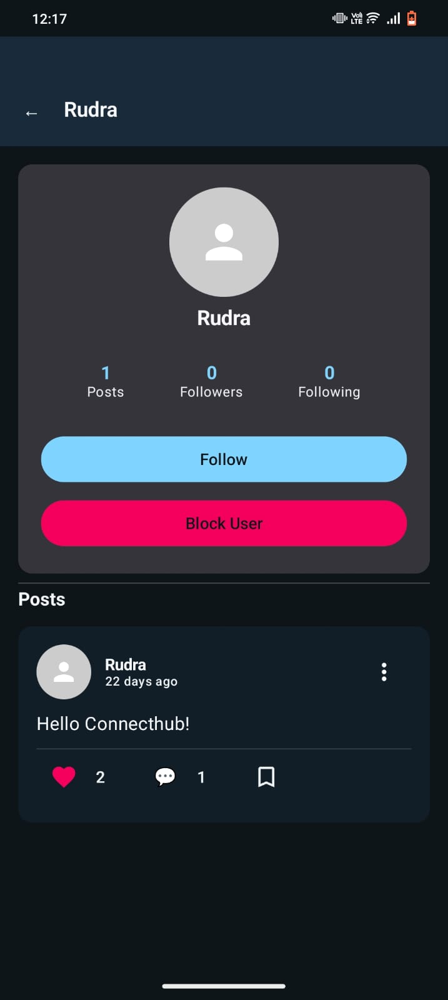
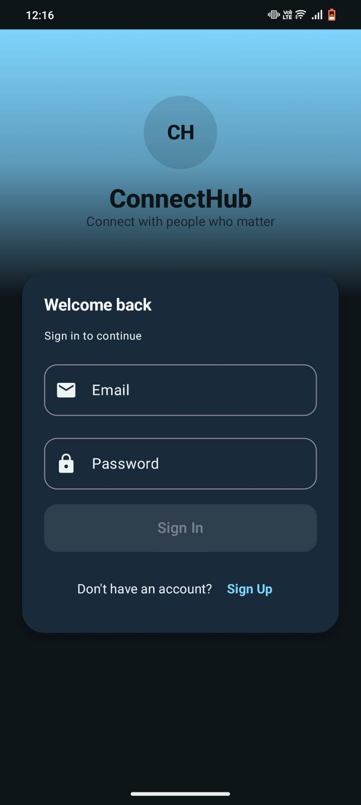
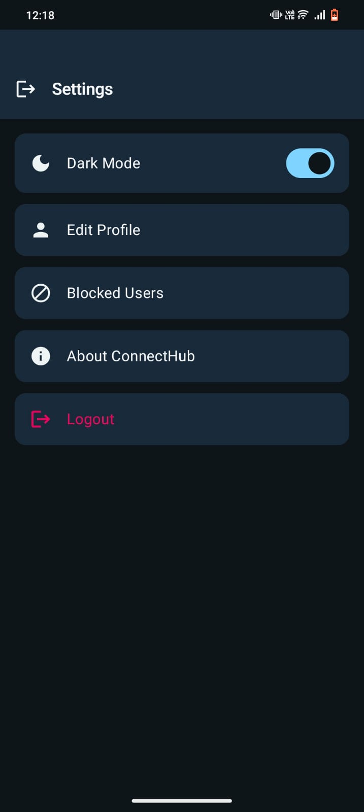

# ConnectHub

A full featured social media Android app built with Kotlin and Jetpack Compose,
using Firebase Authentication and Firestore as the backend.

## 📸 Screenshots

| Home Feed | Comments |
|-----------|----------|
|  |  |

| Search | Profile |
|---------|---------|
|  |  |

| Login Screen | Settings |
|---------------|----------|
|  |  |


## Features
- Email/password registration and login via Firebase Auth
- Real time post feed with newest posts first (Firestore snapshot listener)
- Create and delete posts
- Like / unlike posts with animated heart reaction
- Comment on posts with real time updates; delete your own comments
- Follow and unfollow users; followers/following count updated atomically
- View any user's profile with their posts, follower and following counts
- Follow/following list screen, tap any user to visit their profile
- Bookmark posts and view them in a dedicated saved screen
- In-app notifications for likes and comments (with unread badge)
- User search with real time case insensitive prefix matching
- Block and unblock users; manage blocked users from settings
- Report posts with duplicate report prevention
- Profile image upload via ImgBb API (Retrofit multipart)
- Edit profile : username, bio, profile picture
- Dark mode toggle persisted across sessions with DataStore
- Shimmer loading placeholders while feed data loads
- 14-screen navigation graph with Jetpack Navigation Compose

## Tech Stack
- Kotlin
- Jetpack Compose (fully declarative UI)
- MVVM Architecture
- Firebase Authentication (email/password)
- Firebase Firestore (real time NoSQL database)
- Firestore Security Rules (write-only reports collection)
- Retrofit + Gson (ImgBb image upload API)
- Jetpack DataStore (dark mode preference)
- Coil 3 (profile image loading)
- Kotlin Coroutines + Flow (viewModelScope)
- Jetpack Navigation Compose (14 routes)
- Material Design 3

## Architecture
Follows MVVM pattern with a Repository layer per feature:

```
UI (Compose Screens)
        ↓
ViewModels (one per feature)
        ↓
Repositories (one per domain)
        ↓
Firebase Auth / Firestore / ImgBb API
```

## Firestore Structure
```
users/          → user profiles (uid, username, usernameLower, bio, blockedUsers, counts)
posts/          → all posts (content, likedBy[], likeCount, commentCount)
comments/       → per-post comments
notifications/  → like and comment notifications
bookmarks/      → saved posts per user
follows/        → follow relationships (followerId + followingId)
reports/        → reported posts (write-only for regular users)
```

## Project Structure
```
com.example.connecthub
├── data
│   ├── model
│   │   ├── Post.kt
│   │   ├── User.kt
│   │   ├── Comment.kt
│   │   ├── Notification.kt
│   │   ├── Bookmark.kt
│   │   ├── Follow.kt
│   │   ├── Report.kt
│   │   └── ImgBbResponse.kt
│   ├── preferences
│   │   └── SettingsPreferences.kt   → DataStore dark mode
│   └── repository
│       ├── AuthRepository.kt        → Firebase Auth (register, login, logout)
│       ├── FeedRepository.kt        → Posts CRUD, real-time listener, like transactions
│       ├── CommentRepository.kt     → Comments CRUD, real-time listener
│       ├── FollowRepository.kt      → Follow/unfollow, FieldValue.increment counts
│       ├── BlockRepository.kt       → Block/unblock with arrayUnion/arrayRemove
│       ├── BookmarkRepository.kt    → Save/remove bookmarks, fetch bookmarked posts
│       ├── NotificationRepository.kt→ Create/read notifications, mark as read
│       ├── ProfileRepository.kt     → User search (prefix match), getUserByUid
│       ├── ImageRepository.kt       → ImgBb multipart image upload
│       ├── ImgBbApiService.kt       → Retrofit interface for ImgBb
│       └── ReportRepository.kt      → Submit reports (duplicate check)
├── ui
│   ├── NavGraph.kt                  → 14-route navigation graph
│   ├── auth
│   │   ├── LoginScreen.kt
│   │   └── RegisterScreen.kt
│   ├── feed
│   │   ├── FeedScreen.kt
│   │   ├── PostItem.kt
│   │   ├── CommentScreen.kt
│   │   ├── CommentItem.kt
│   │   └── ReportDialog.kt
│   ├── profile
│   │   ├── ProfileScreen.kt
│   │   ├── UserProfileScreen.kt
│   │   ├── EditProfileScreen.kt
│   │   ├── SearchUserScreen.kt
│   │   └── FollowListScreen.kt
│   ├── notification
│   │   └── NotificationScreen.kt
│   ├── bookmark
│   │   └── BookmarkScreen.kt
│   ├── settings
│   │   ├── SettingsScreen.kt
│   │   └── BlockedUsersScreen.kt
│   ├── components
│   │   └── LoadingPostItem.kt       → Shimmer placeholder
│   └── theme
│       ├── Color.kt
│       ├── Theme.kt
│       └── Type.kt
├── utils
│   ├── Constants.kt                 → Firestore collection name constants
│   └── TimeUtils.kt
└── viewmodel
    ├── AuthViewModel.kt / AuthUiState.kt
    ├── FeedViewModel.kt / FeedUiState.kt
    ├── CommentViewModel.kt / CommentUiState.kt
    ├── FollowViewModel.kt / FollowUiState.kt
    ├── FollowListViewModel.kt / FollowListUiState.kt
    ├── ProfileViewModel.kt / ProfileUiState.kt
    ├── UserProfileViewModel.kt / UserProfileUiState.kt
    ├── SearchViewModel.kt / SearchUiState.kt
    ├── NotificationViewModel.kt / NotificationUiState.kt
    ├── BookmarkViewModel.kt / BookmarkUiState.kt
    ├── BlockedUsersViewModel.kt / BlockedUsersUiState.kt
    ├── ReportViewModel.kt / ReportUiState.kt
    └── SettingsViewModel.kt
```

## Installation
1. Clone the repo
2. Create a Firebase project at [console.firebase.google.com](https://console.firebase.google.com)
3. Enable **Email/Password** authentication
4. Create a **Firestore** database
5. Download `google-services.json` and place it in the `app/` folder
6. Add your **ImgBb API key** to `res/values/strings.xml`:
   ```xml
   <string name="imgbb_api_key">YOUR_KEY_HERE</string>
   ```
7. Sync Gradle and run on emulator or device (Android 8.0+)

## Key Technical Decisions
- **Firestore transactions** used for like toggling to prevent race conditions when multiple users like the same post simultaneously
- **`FieldValue.increment()`** used for follow/follower counts to avoid read-modify-write race conditions
- **`FieldValue.arrayUnion/arrayRemove`** used for block list updates — no array download needed
- **`ListenerRegistration`** stored in ViewModel and removed in `onCleared()` to prevent Firestore snapshot listener memory leaks
- **`usernameLower` + Unicode `\uf8ff`** range query for case-insensitive prefix search without loading all users
- **Duplicate notification guard** prevents repeated LIKE notifications on like→unlike→like
- **Self-notification guard** prevents users from being notified about their own actions

## What I Learned
- Building a full-stack Android app with Firebase as the backend
- Handling real-time data with Firestore snapshot listeners and managing their lifecycle
- Using Firestore transactions and FieldValue operations for data consistency
- Implementing a scalable MVVM architecture with one ViewModel and Repository per feature
- Uploading images to a third-party API (ImgBb) using Retrofit multipart requests
- Persisting user preferences with Jetpack DataStore
- Managing a 14-screen navigation graph with Jetpack Navigation Compose
- Designing Firestore security rules to restrict data access by role

## Challenges Faced
- Preventing Firestore snapshot listener memory leaks across screen navigation
- Keeping like counts consistent under concurrent updates without using Cloud Functions
- Making user search case-insensitive without downloading the entire users collection
- Keeping follower/following counts accurate on follow/unfollow without transactions

## Future Improvements
- Direct messaging between users
- Image posts (currently text-only)
- Push notifications via Firebase Cloud Messaging
- Explore / trending posts feed
- Pagination with Firestore cursors

## License
MIT License
